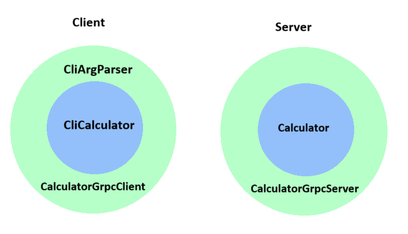
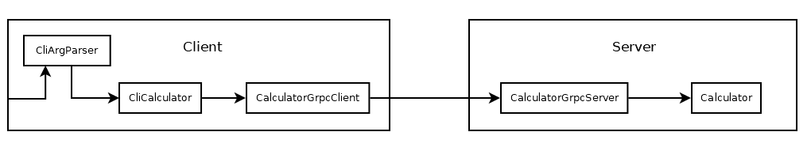

# Setup / Installation / System requirements

System requirements: .net 9 runtime

Binaries for Windows and Linux can be downloaded from the "build, test and publish" CI job's artifacts.

Building from source should work as expected.

# Requirements analysis

Open questions:

- Which datatypes should be supported, and what should the exact semantics be like (underflow, overflow, divide by zero,
  catastrophic cancellation, etc.)
- Which common server application features are required, like authentication, authorization, reverse-proxy setup, load
  balancing, https termination
- In which direction is the software expected to grow. E.g. more operations, more datatypes, more complex calculations,
  something else entirely

Assumptions for the exercise:

- `double`, with default semantics (except for division by 0, because it's un-intuitive and I wanted to try the error
  handling)
- bare-bones ASP.net server. (no auth, middleware, proxy, additional configurability, logging)
- No specific direction for further development, but a focus on flexibility and testability. Performance (throughput,
  latency) is not a concern.

# API Design

One gRPC method for each operation (add, subtract, ...), each with their own request/response messages. This allows for
independent modifications as requirements evolve.

The server operations are idempotent. So for fault tolerance, a simple retry on the client side iss sufficient.

# Architecture / Design decisions

The server follows a clean architecture approach.
Separate service methods are used for the various math operators, so that exact semantics can be changed easily.

The client is inspired by clean architecture, but uses manual DI instead of some automatic setup for simplicity.

I am aware that clean architecture is complete overkill for the stated problem. It does make sense for the assumed
outlook of "This calculator will grow for many years" though.

## Trace of a calculation request

(all callees are injected dependencies)

Parts:

- **CliArgsParser** Parse cli parameters
- **CliCalculator** Translate cli parameters to calculator method calls and format result
- **CalculatorGrpcClient** Proxy for the remote calculator service
- **CalculatorGrpcServer** Provides a remote interface for the `Calculator`
- **Calculator** Does the actual calculation

## Miscellaneous

The entry points for client and server are the respective `Program.cs` files.

The protobuf code is generated in a shared project, to avoid naming collisions in Test projects that import both client
and server.

# Tests

There are unit tests for all components mentioned in the architecture section. The CI runs on every push.

There's also a simple end-to-end integration test job (`e2eTest.sh`).

# TODOs / things to improve

- Server integration test
- Automatic DI setup for the client
- Client CLI arg parsing needs better error messages (and maybe a different library), and proper locale handling
- Logging
- Better abstraction for the CLI interface (printing, parsing)
- Formalize and test client error handling
- Implement retry